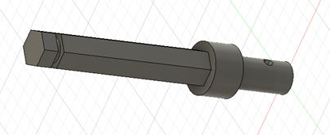
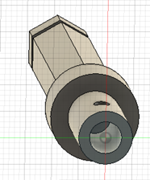
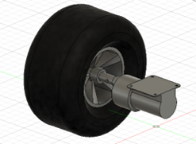
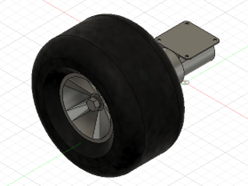

# Rapport de séance du mardi 14/10/2022

## Goal of session: modeling the different components of the mechanical transmission

In order to make a first model of the robot and to decide how we will arrange the elements, I will make each part on Fusion360.

<b>Gear Motor DC:</b>

<b>Wheel:</b>

So, I observe the first problem, we must find a way to connect the hexagonal core of diameter 12mm with the output shaft of the motor of diameter 6 mm circular with a flat.

<b>Connection:</b>

Here is the chosen model, on one side a bore to receive the motor shaft with a hole to put a screw to maintain it in place. On the other side a hexagonal shaft to insert in the hub of the wheel with a groove that can receive a circlip to lock it.

<b>Finale assemble:</b>

