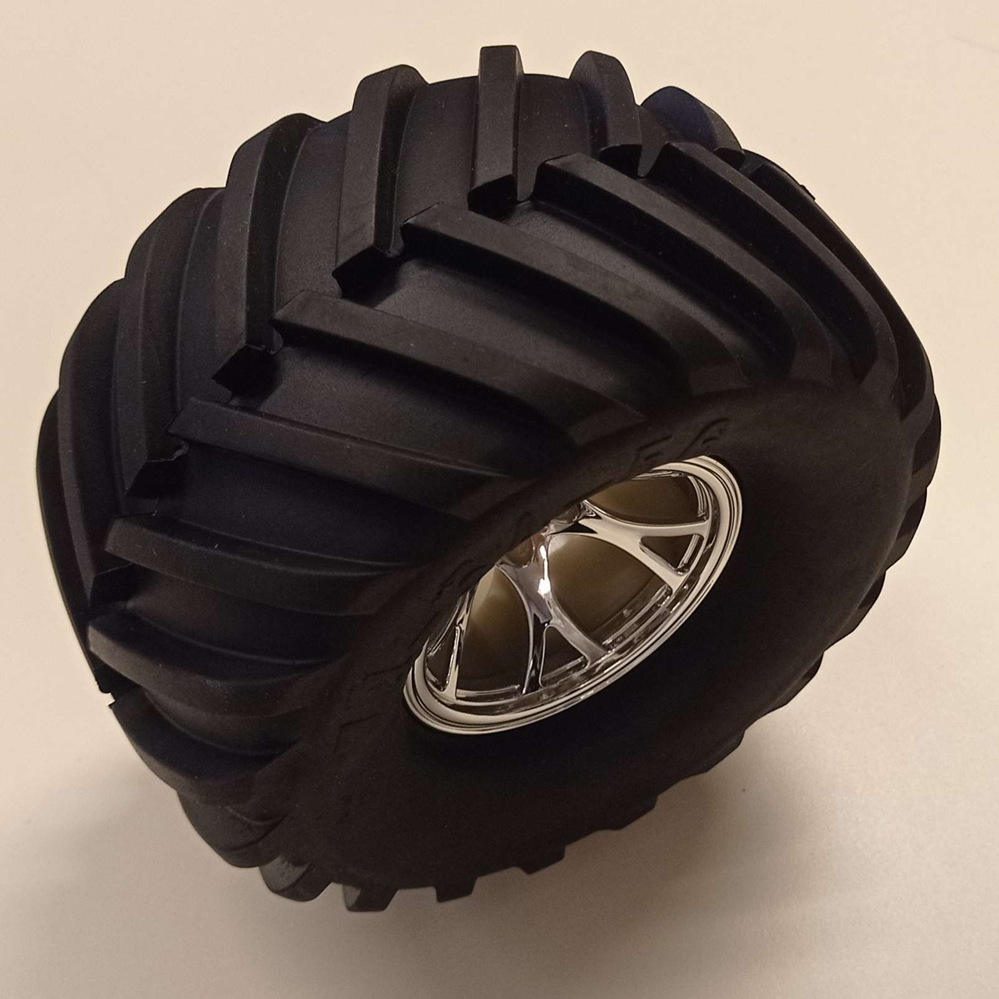
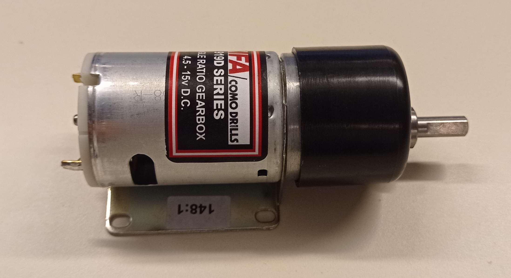
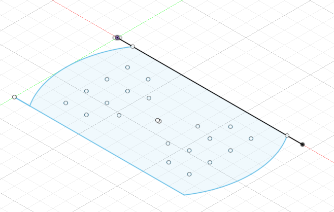
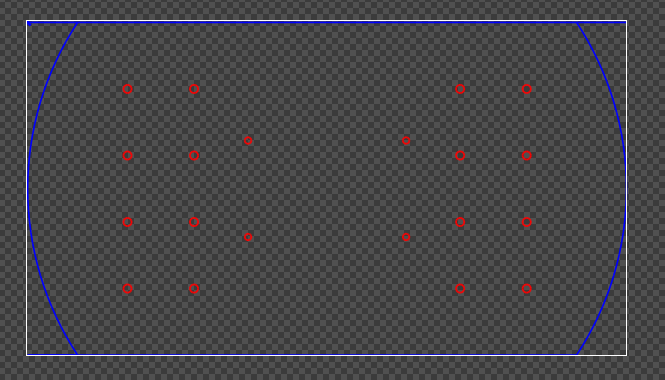
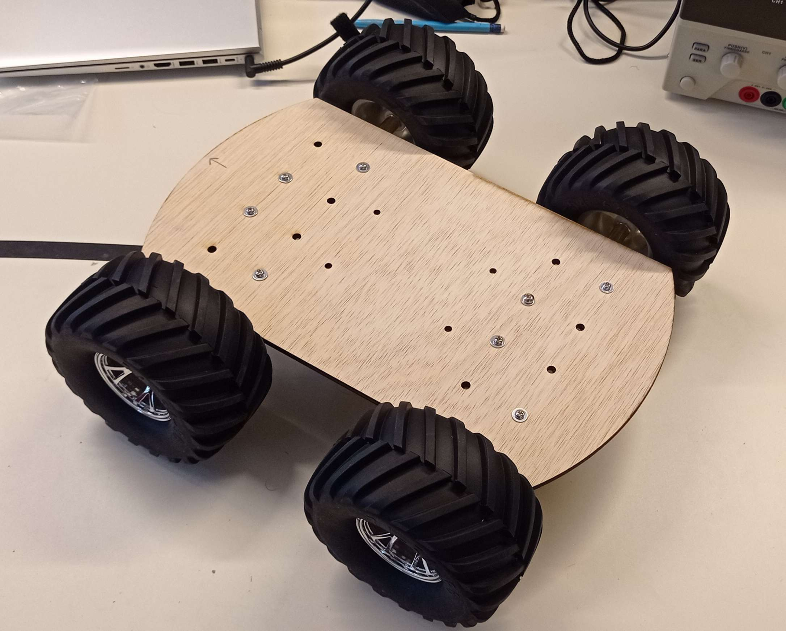
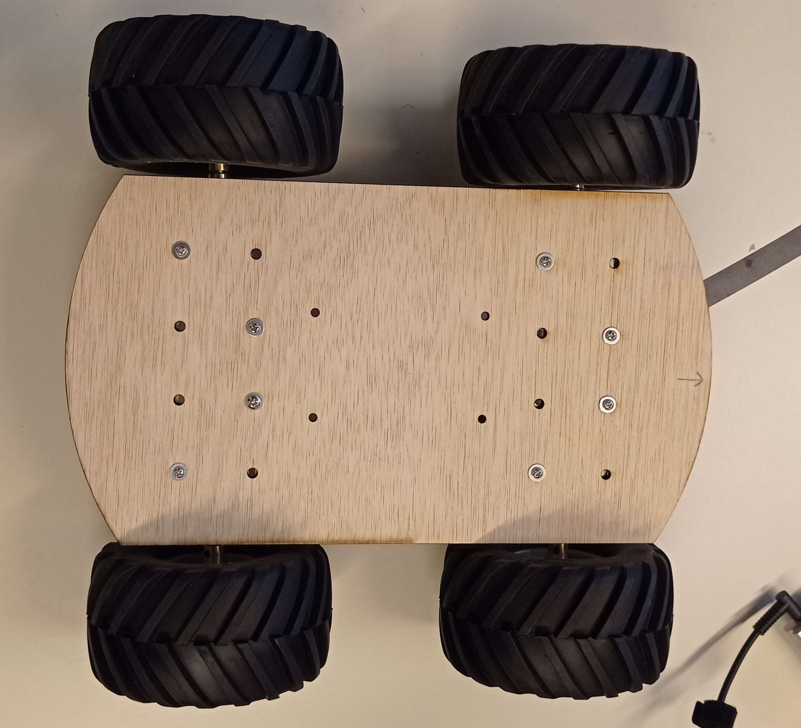
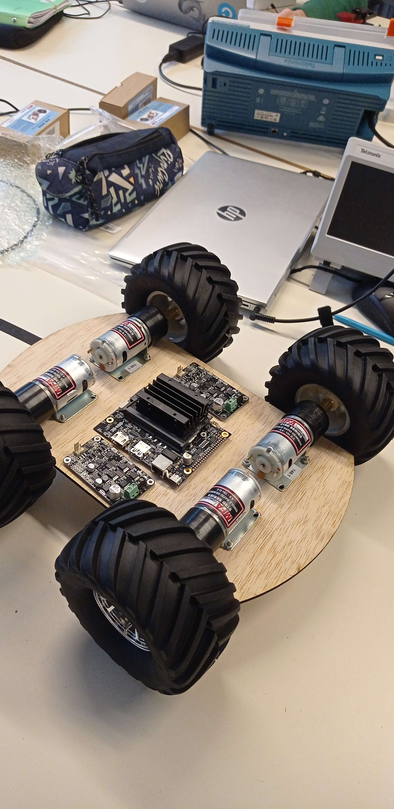

# Rapport de séance du mardi 15/11/2022

### Goal of the session: Starting beginning of the construction of the chassis

We just received the motors and the wheels, as well as the adaptator.

Now, I'm going to draft the chassis on inventor 

And export the model to inkscape to make a lasercut on a wooden board of 5mm

I then started to assemble the robot

