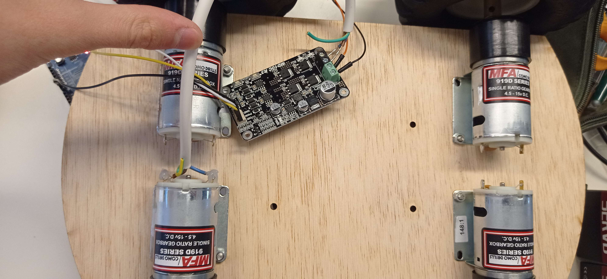
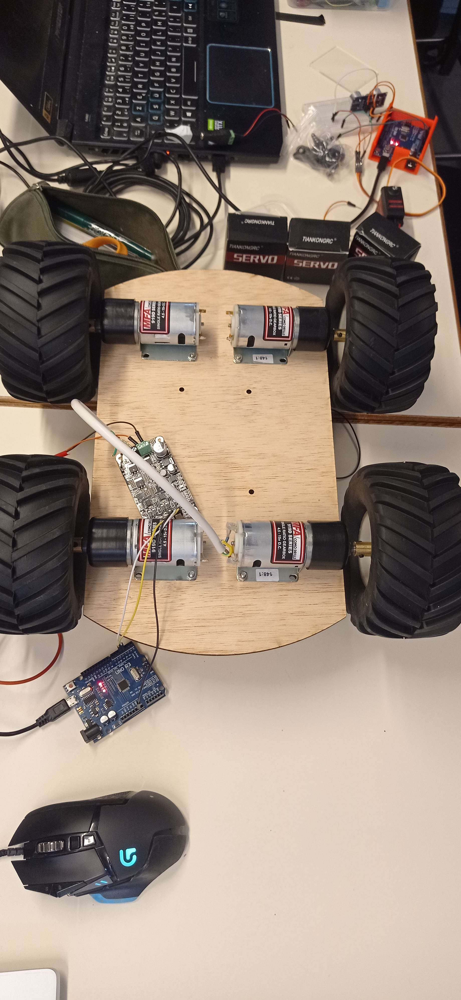
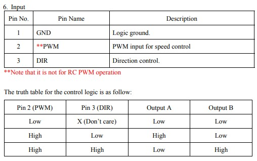
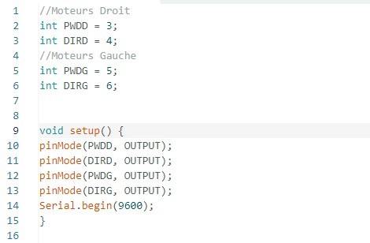
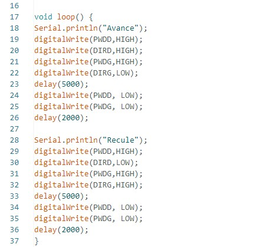

# Rapport de séance du mardi 25/11/2022

### Goal of the session: operate the motors

I first started by assembling cables to the motors. I then connected the cyt-132 (command) card, Arduino card and motors.

 

I will have to create an Arduino program to operate the cyt-132 which I have found the truth table.

 

I have created this script for basic mouvement as moving forward and back.

