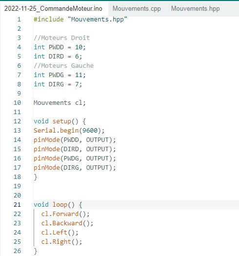
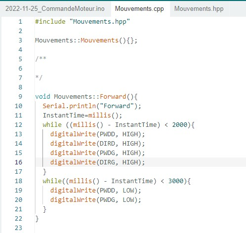
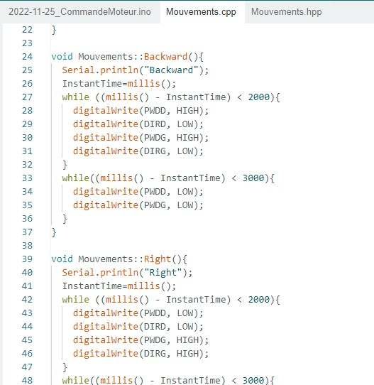
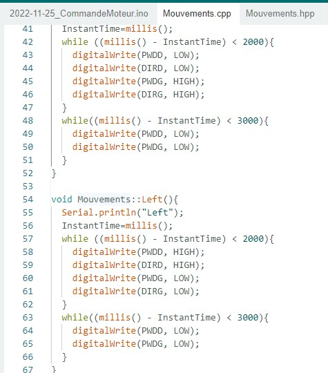
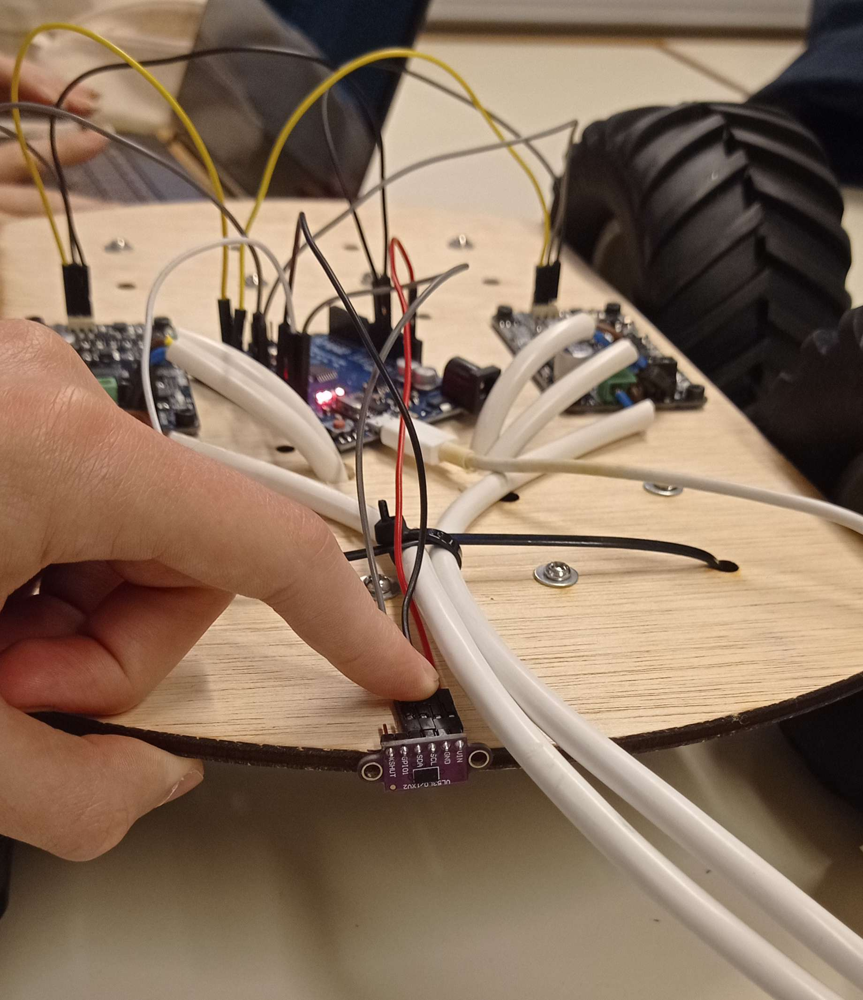

# Rapport de séance du mardi 06/12/2022

### Goal of the session: Make proper movements

I created a new program, with clearer movements.

 

 
And then I'm going to implement some captors to the robot as the laser to avoid obstacles.

