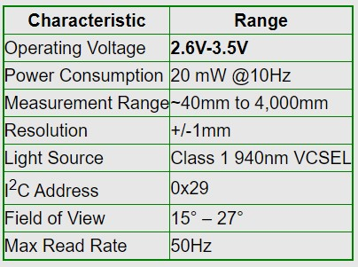
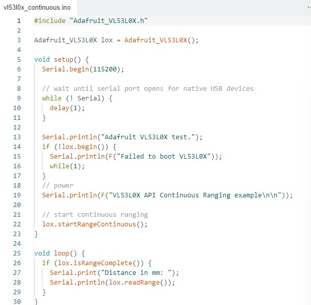
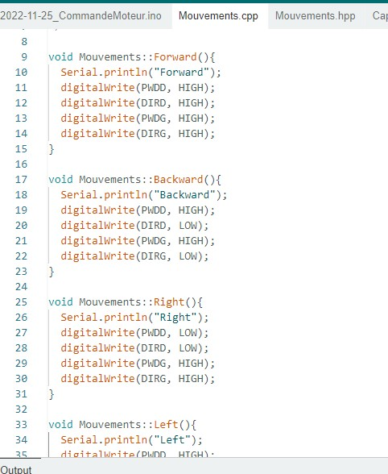
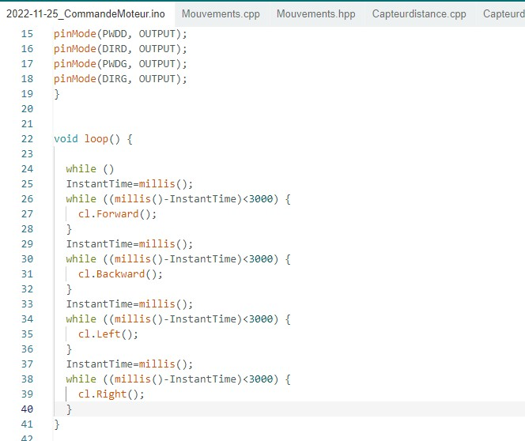
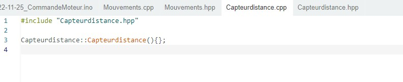
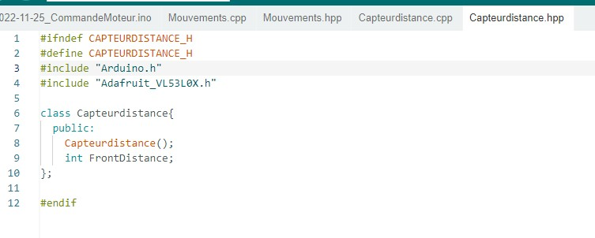

# Rapport de séance du mardi 09/12/2022

### Goal of the session: Implement the laser to the code

Those are some informations I have found about VL53L1XV laser captor

 

I have found a template and I am working on implementing it.

 

I have also changed the code structure to implement the captor and being able to stop the robot when needed

 

This is the new class I have created but it is not finished

