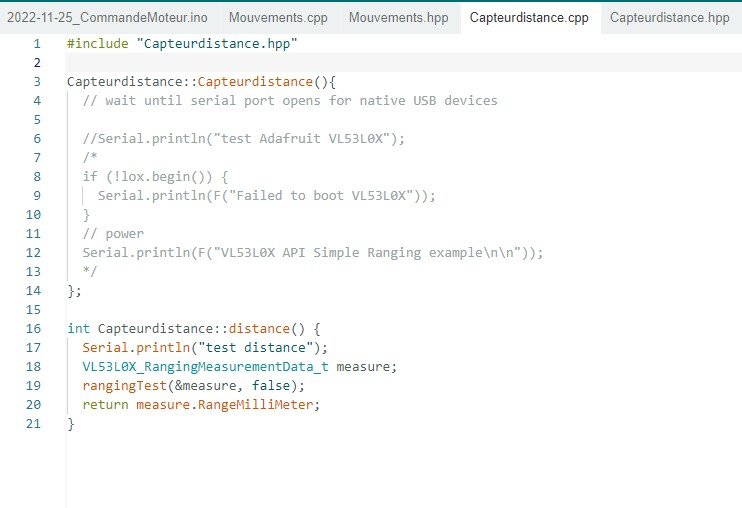
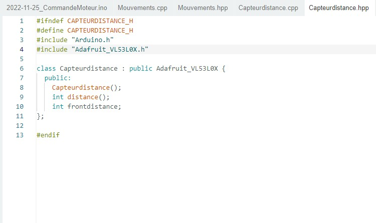
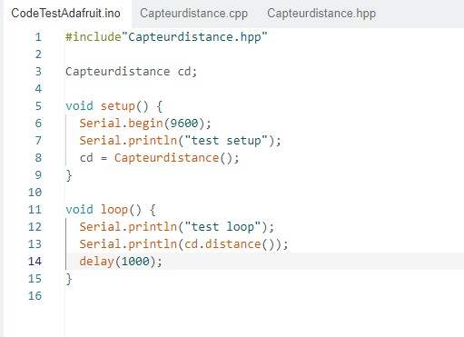

# Rapport de séance du mardi 14/12/2022

### Goal of the session: Still implementing the laser to the code

The code I have first made didn't even compile, because I didn't know the syntax used to implement a library into a headers. So after asking for help, I made this code: 

 

 

It compile but do not work, so I have made a separate code to find where the problem is from.

It seems it comes from the rangingTest in Capteurdistance.cpp, so I have to open the library Adafruit and find why it didn't work
