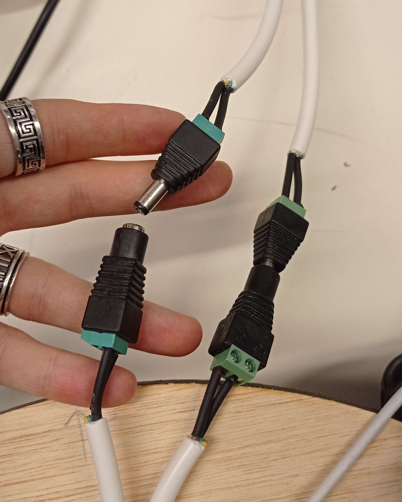
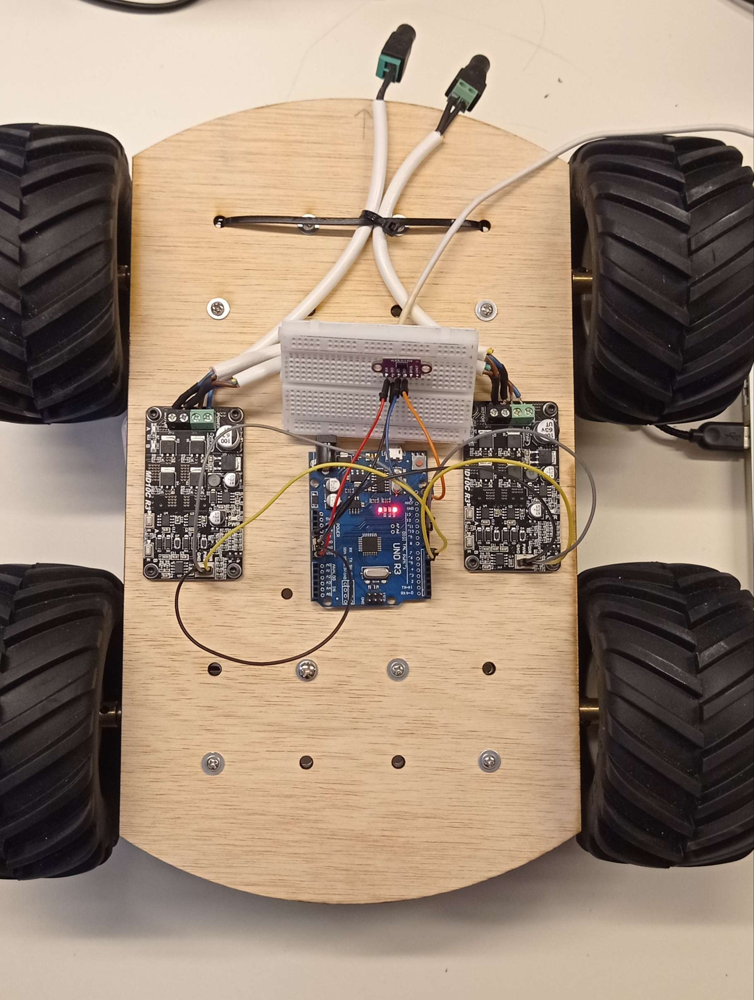

# Rapport de séance du mardi 16/12/2022

### Goal of the session: Implement the laser to the code

I started by adding a detachable connector between the power supply and the robot, to facilitate transportation for working during my hollidays.

I then have continue the code for the laser, and decided to let down the header and rather implement the laser code in the main because I was not able to find the problem I have got.