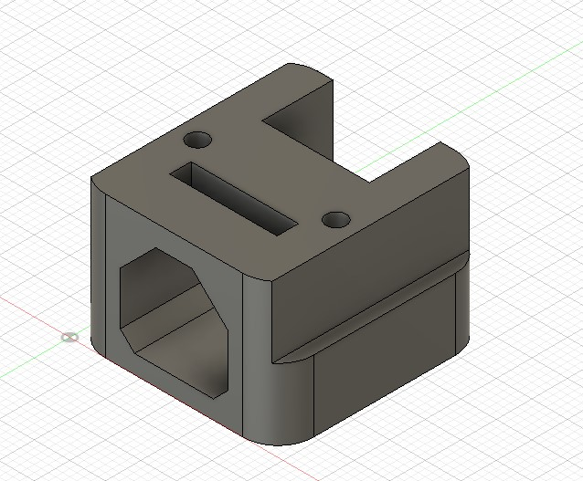
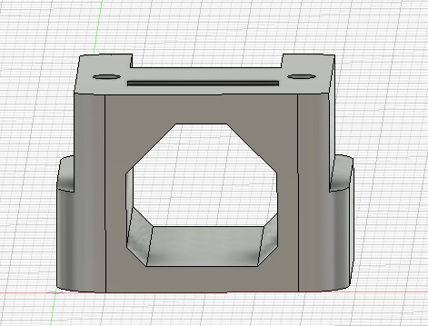
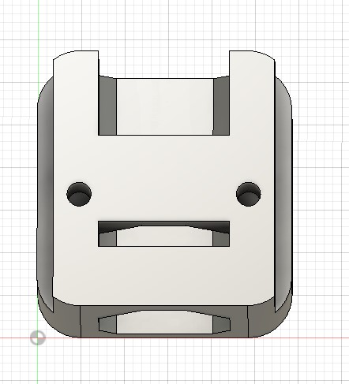
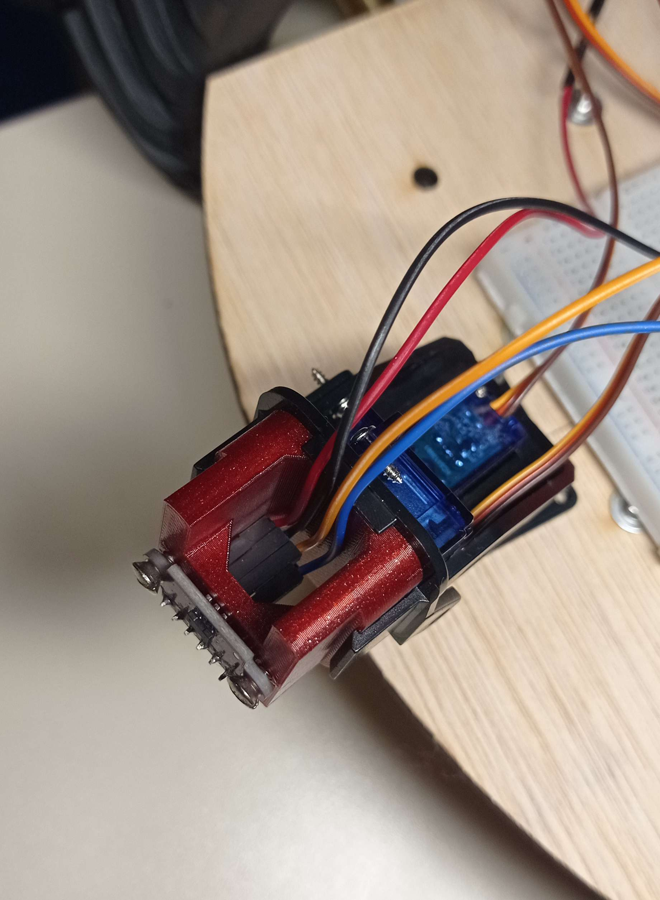
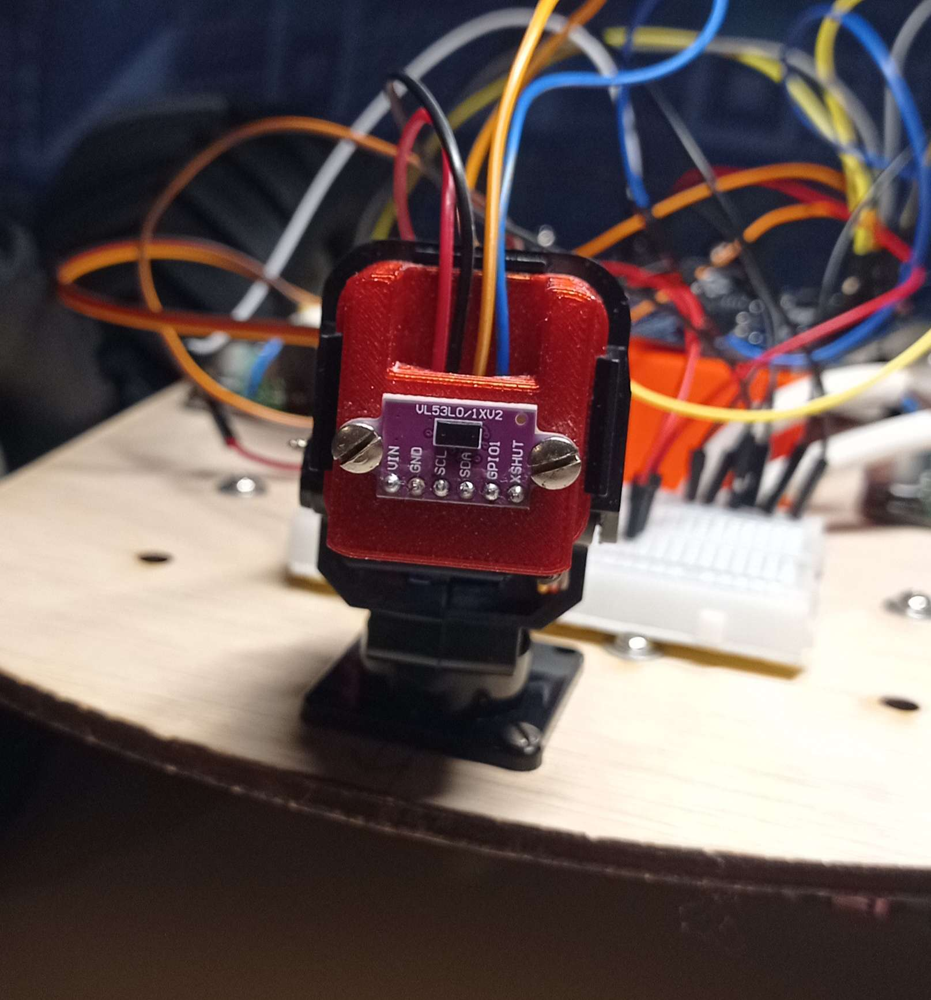
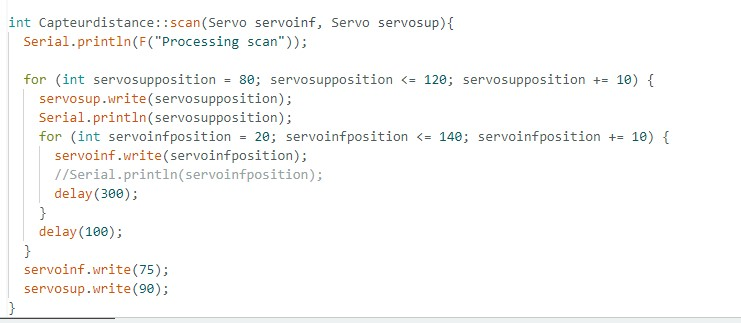

# Rapport de séance du mardi 16/01/2023

### Goal of the session: Allow the laser to scan the obstacles

I want to find a way to scan the obstacles to make a decision to avoid them.

I found a 2 axis arm where I can mount the laser: 

 

 

So I created an adaptator on fusion360: 

 

 

 

Then I coded a function scan, to sweep on an angle of 40° in height and 120° on side. For a total of 48 measurement.

 

