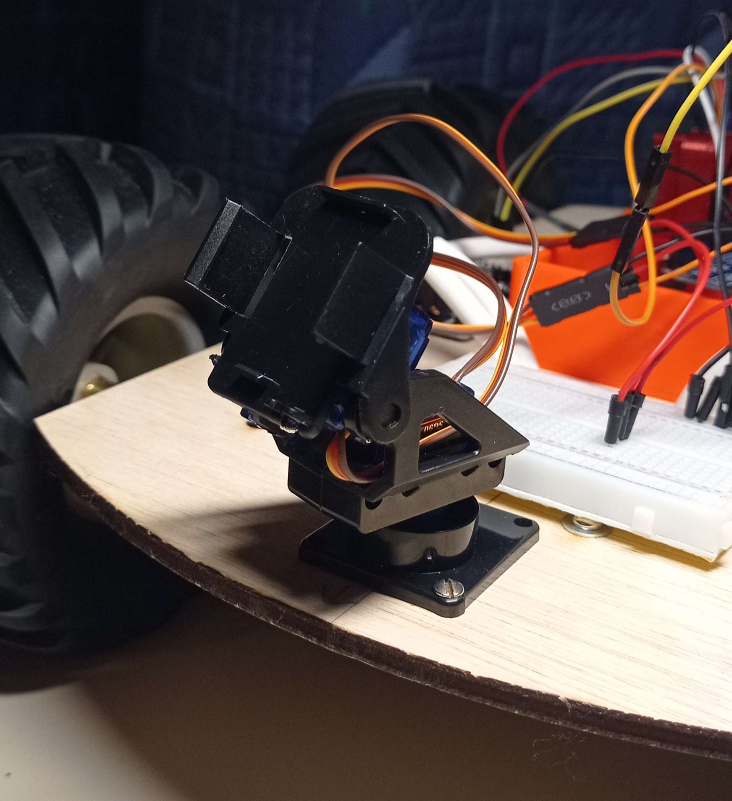
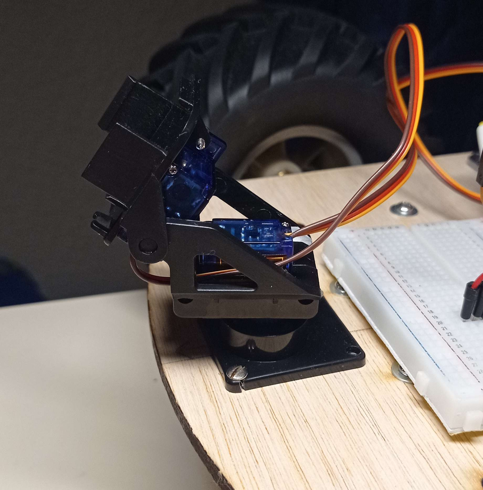

# Rapport de séance du mardi 16/01/2023

### Goal of the session: Allow the laser to scan the obstacles

I want to find a way to scan the obstacles to make a decision to avoid them.

I found a 2 axis arm where I can mount the laser.

 

