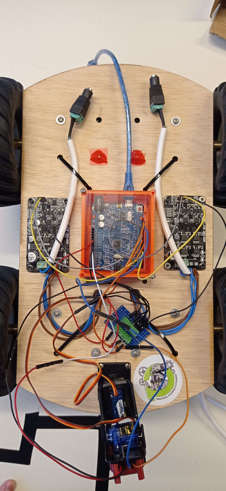
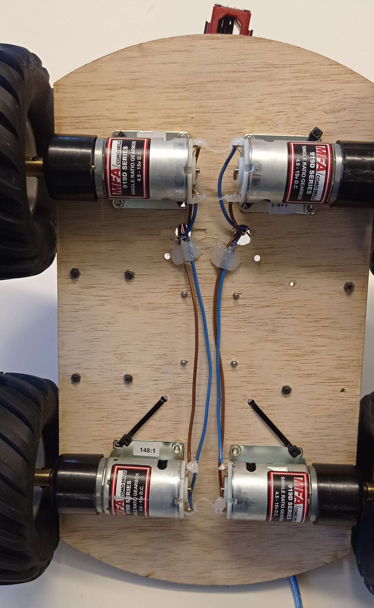
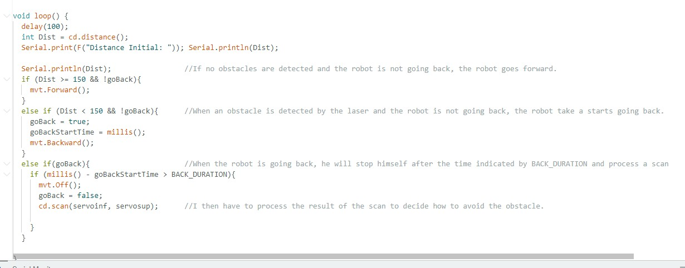
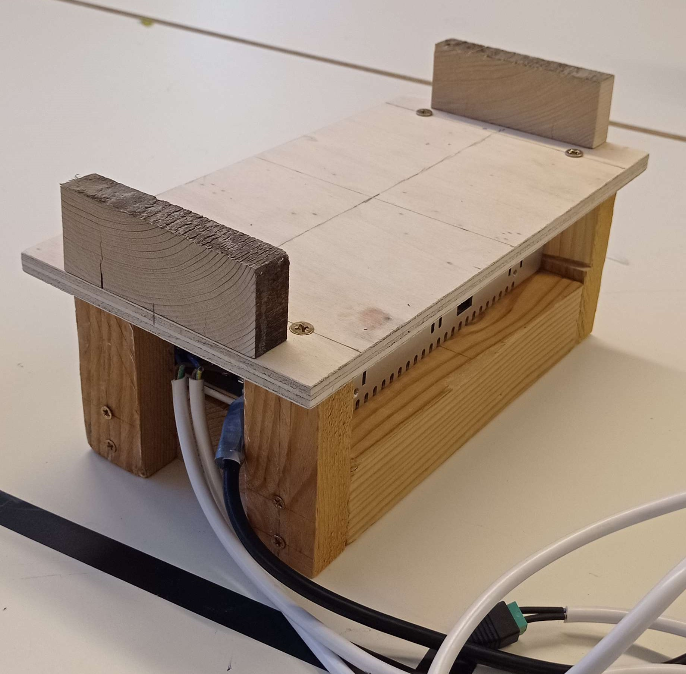
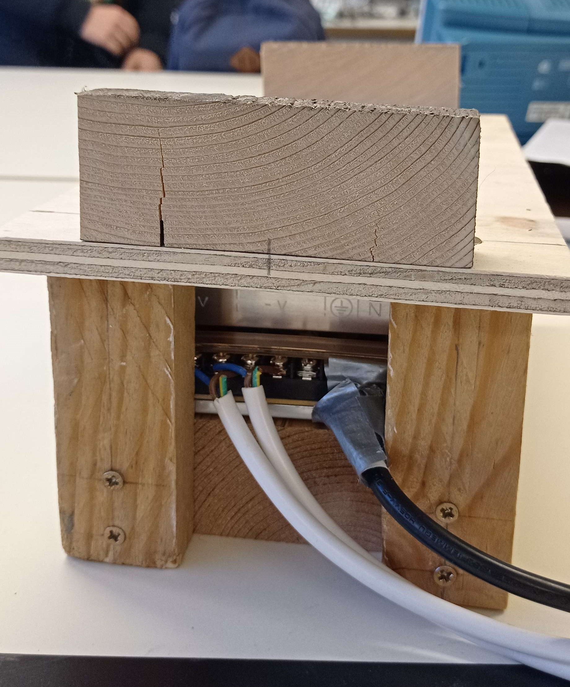
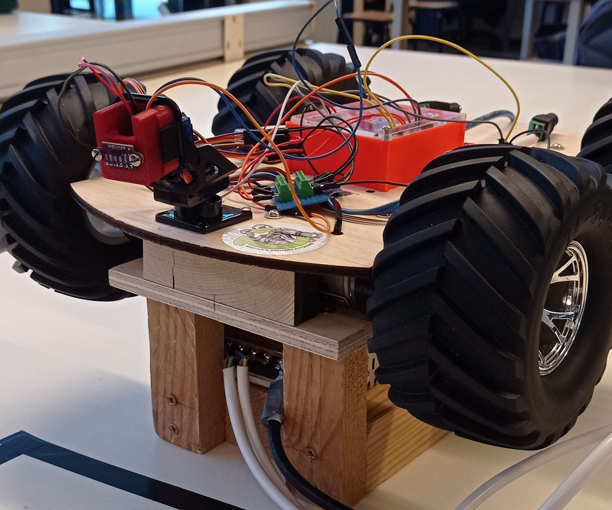

# Rapport de séance du mardi 31/01/2023

### Goal of the session: Finalize the scaning process

 

Après un court-cicruit qui a détruit une carte de commande de moteur, je me suis vu obligé de recabler l'ensemble de l'alimentation en puissance du robot afin de sécuriser ce dernier pour l'avenir. 

Je me suis également rendu compte que les vis à l'intérieur de la boîte de protection de la carte arduino étaient à l'orignie de court-circuit. En les sécurisant avec du scotch isolant ce qui à réglé beaucoup de bug que j'avais dans mon programme.

 

J'ai ensuite fini le code du scan afin qu'il stock les mesure qu'il prend dans un tableau qui sera ensuite analysé pour prendre une décision et éviter les obstacles. 

 

Le code dans le main a été revu afin qu'il soit plus propre et plus optimisé. J'ai rajouté le booléen goBack qui indique si le robot est entrain de reculer et la variable BACK_Duration qui va permettre de mesurer le temps qui s'est écoulé depuis goBackStartTime afin de faire reculer le robot d'un temps donné.

 

Dans un autre domaine, j'ai créé un socle en bois afin de poser le robot pendant le codage et afin de pouvoir le présenter durant la journée porte ouverte de l'école le samedi 4 février. Ce socle contient le transformateur afin d'optimiser l'espace autour du robot.

