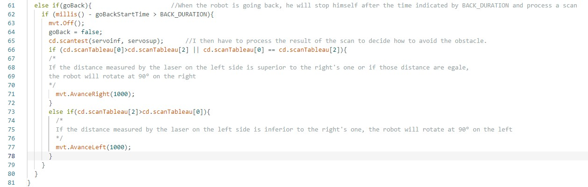

# Rapport de séance du mardi 28/02/2023

### Goal of the session: Artificial intelligence applied to obstacle avoidance

 

Je continue le programme pour éviter les murs et obstacles, avant de passer au programme qui permettra de déplacer le robot sur l'ensemble de la surface à nettoyer.

 

Quand le laser frontal rencontre un objet à moins de 15 cm devant lui, il va reculer et prendre 3 mesures à des angles différents et en fonction de ces résultats il va se tourner et partir d'un autre côté.

J'ai ensuite commencé a adapté ce système avec plus de valeurs d'angles pour éviter certaines situations problèmatiques.