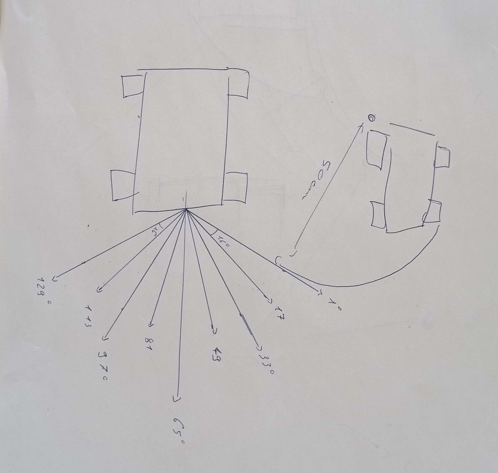
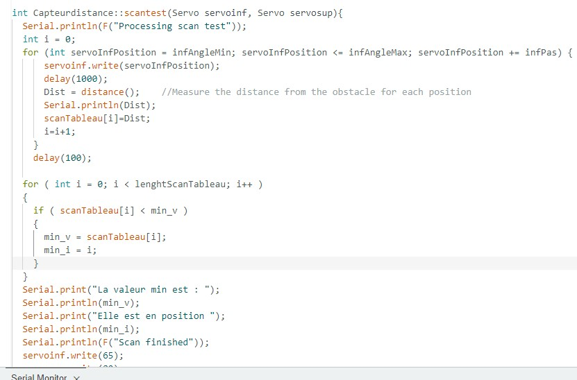
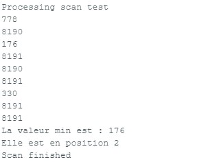

# Rapport de séance du mardi 07/03/2023

### Goal of the session: Artificial intelligence applied to obstacle avoidance

 

J'ai rajouté 6 position du capteur laser pour éviter les obstacles 

 

 

En premier j'ai donc rajouté dans la fonction scan une fonctionnalité qui donne la distance minimale obtenue et pour quel angle on la trouve.

 

Vers la fin de la séance, j'ai décidé de changer le fonctionnement du détecteur d'obstacle et de passer sur une version de scan continu, afin d'éviter les problèmes de collision avec des objets dont les angles par rapport au côté du robot sont très faible. (Le laser continu de viser devant et donc ne voit pas l'objet sur le côté) pour ce faire utiliser la fonction millis sur le scan et effectuer une mesure pour un angle à chaque loop du main(), et ainsi faire angle par angle toutes les 250ms. J'ai donc commencer a modifier mon code ensuite et le travail que j'avais fait au début de la séance.