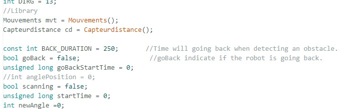
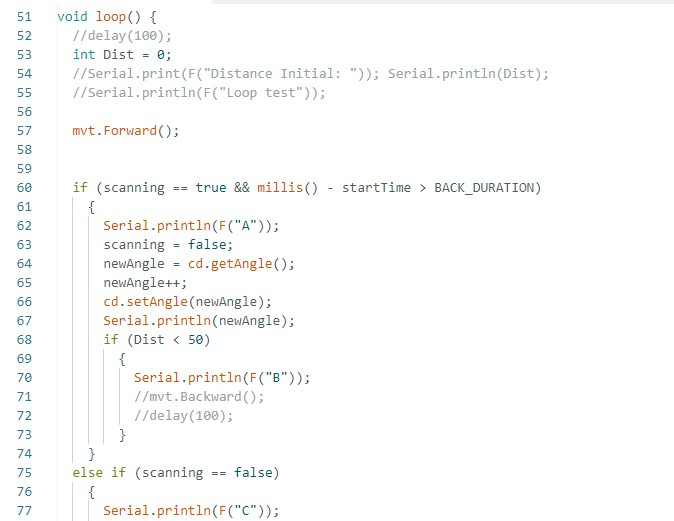
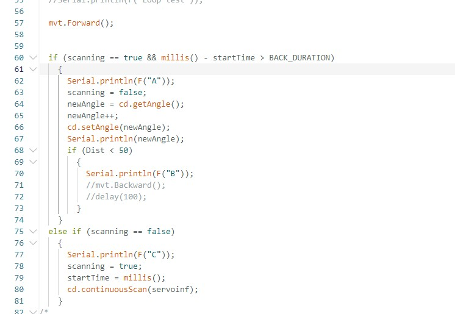

# Rapport de séance du mardi 13/03/2023

### Goal of the session: Artificial intelligence applied to obstacle avoidance 

 

Durant cette séance, j'ai continué le nouveau code du robot. L'idée derrière ce changement est de scanner en continu, voici ce que j'ai fait:

