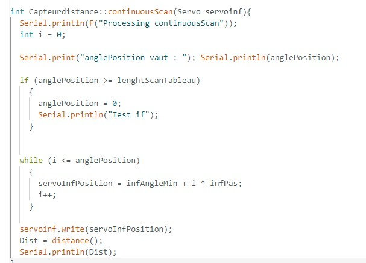
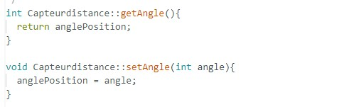

# Rapport de séance du mardi 13/03/2023

### Goal of the session: Artificial intelligence applied to obstacle avoidance 

 

Durant cette séance, j'ai continué le nouveau code du robot. L'idée derrière ce changement est de scanner en continu, voici ce que j'ai fait:

 

Tant que le temps de BACK_DURATION n'est pas dépassé, le robot ne relance pas un scan, dès que ce temps est dépassé on relance on mesure la distance et si elle est inférieur à 5cm on recule. 

 

J'ai rajouté un programme dans la library CapteurDistance, qui prend une valeur de distance pour un angle qui change a chaque passage de la loop. 

J'ai également rajouté ces deux programme qui permettent de récupérer des valeurs de variables sur la library et les envoyer dans le main.

 

Pour l'instant le code ne marche pas, la variable qu'on incrémente pour connaître la position du laser ne retourne pas à 0 lorsqu'elle dépasse la valeur maximale. Le laser reste donc coincé après le premier balayage.