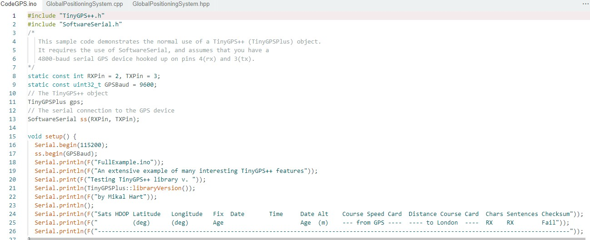
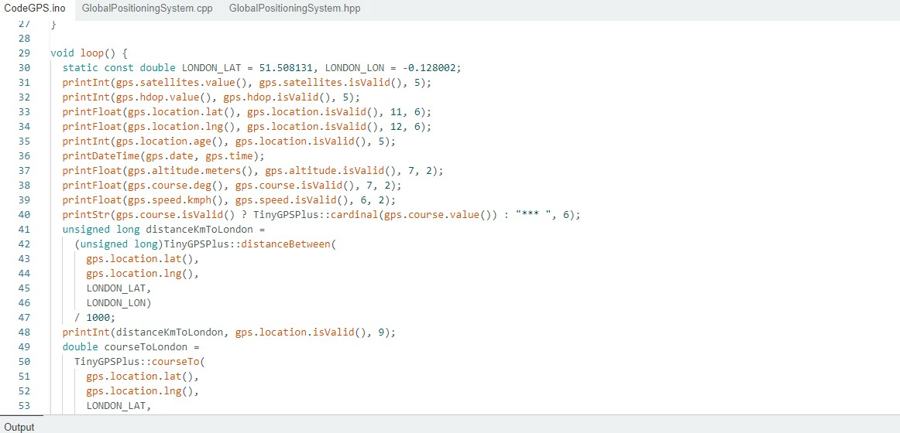
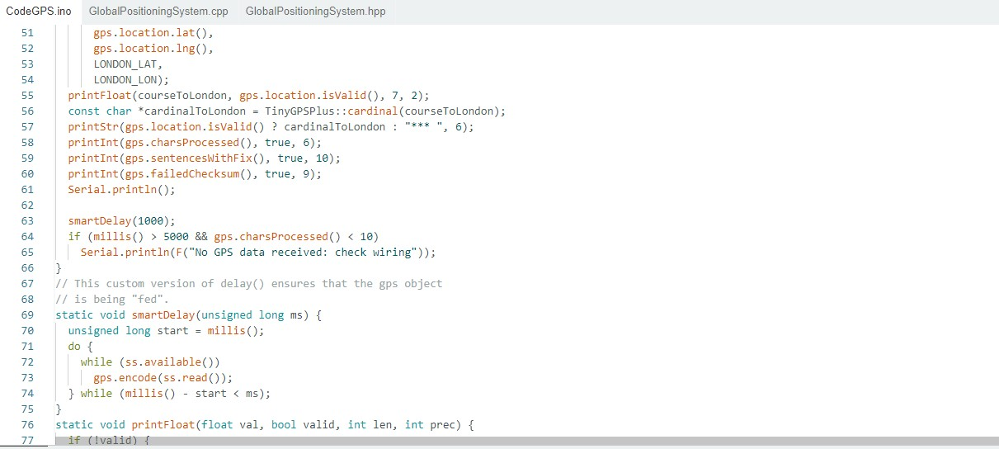
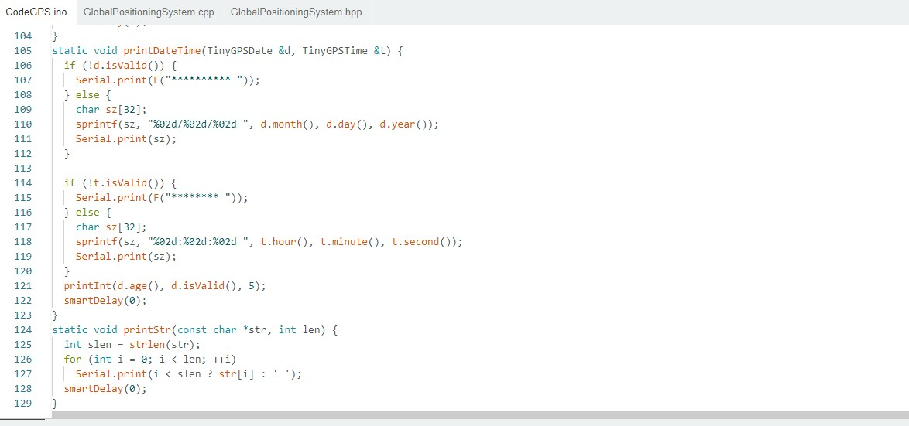
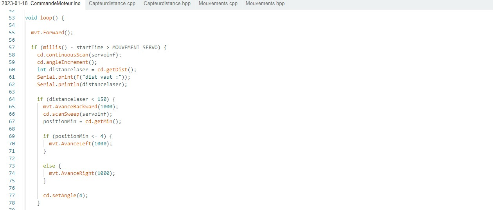
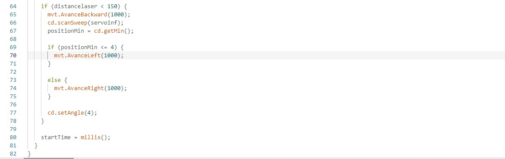
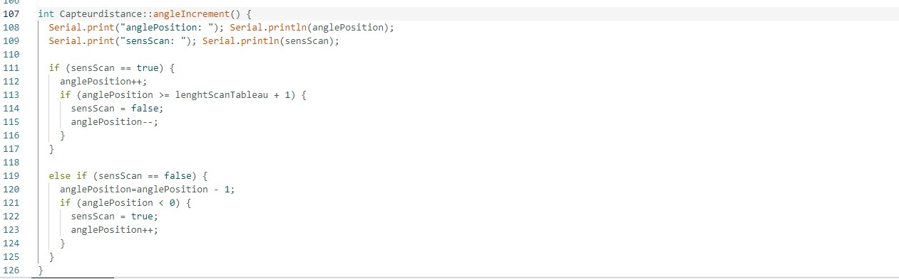
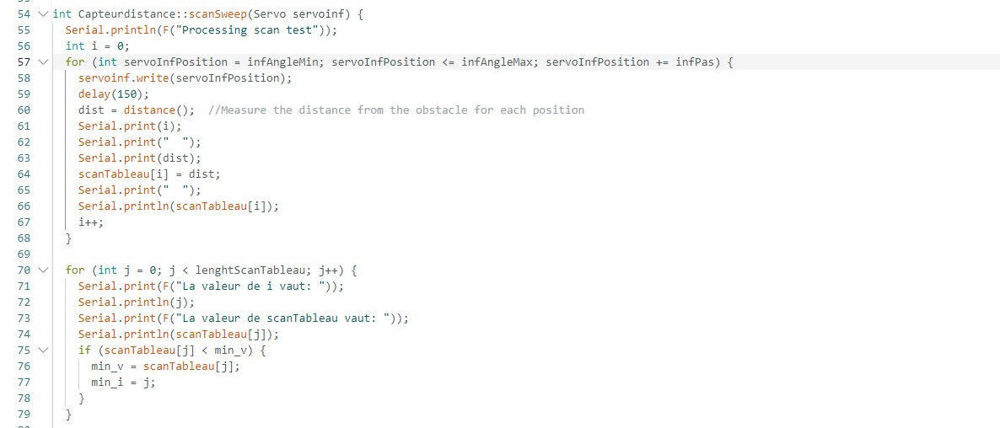
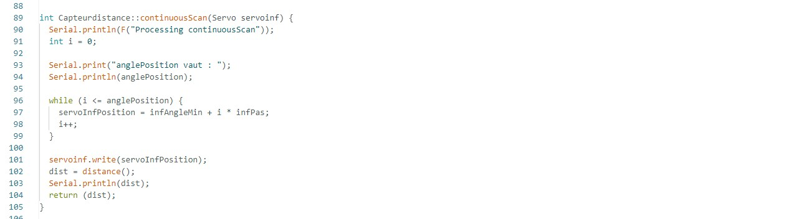

# Rapport de séance du mardi 28/03/2023

### Goal of the session: Installation of the GPS

 

The GPS I am using is a "GPS Module with compass powered by Ublox 7M".

I have found an intersting website with some tips on how it work: 

https://www.instructables.com/Using-a-Hobby-Ace-Ublox-GPS-Module-Built-in-Compas/

 

I also found some code that I can adapt to my robot

 

 

But first I will finally finish my obstacle avoidance code.

 

Le robot va donc avancer tout droit en balayant devant lui en même temps. Lorsqu'un obstacle sera détecté, le robot va reculer puis faire un balayage à l'arrêt pour décider de quel côté il va tourner. La décision du côté se fait en regardant de quel côté est la distance la plus petite.

 

La fonction angleIncrement permet de faire le balayage du laser pendant que le robot avance, Elle augmente ou baisse la valeur de "anglePosition" pour effectuer des aller-retours et ainsi optimiser le déplacement du capteur.

 

La fonction scanSweep fait le balayage et la mesure des différentes distances après que le robot ai détecté un obstacle et reculé. Les valeurs récolté sont mises dans un tableau et ensuite traité dans le main.

 

La fonction continuousScan permet de retranscrire la valeur de anglePosition en une vrai valeur d'angle qui est ensuite appliqué au servomoteur afin de prendre une mesure pendant que le robot se déplace.

 

Le robot se déplace correctement sans problèmes.