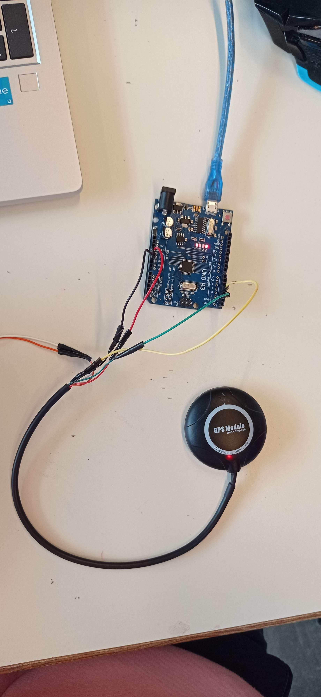
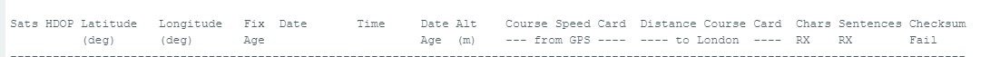
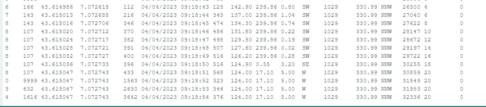

# Rapport de séance du mardi 04/04/2023

### Goal of the session: 

 

Durant cette séance j'ai avancé sur l'utilisation du GPS.

 

J'ai tout d'abord soudé des raccords sur les fils du GPS pour pouvoir les connecter aux différents composants du robot, à savoir la carte arduino pour le moment, je n'utilise pas les cables orange et blanc qui correspondent à d'autre option du module (SDA et SCL).

 

 

J'ai enuite récupérer du code sur internet et l'ai modifié. On obtient les données suivantes :

 
 

 

Il y a plein d'information inutile que je peux enlever, ce qui m'interesse, les seules données intéressantes  pour le robot étant la latitude et la longitude.

J'ai donc commencé à retirer les lignes de code qui ne m'intéresse pas.

Je code que je prévois consisterais à prendre les coordonnées au démarrage du robot, puis comparer en permanence les coordonnées avec cette réference et si l'écart dépasse une certaine valeur qu'on définira plus tard, le robot fera une rotation d'un certain angle et repartira.

Il faut savoir que le gps ne marche pas en intérieur, ce qui ne pose pas de problème pour nous car le robot se déplace sur la plage, qui est une zone très dégagée.