# Rapport de séance du mardi 11/04/2023

### Goal of the session: GPS, New laser arm, and battery sizing

 

J'ai commencé ma séance par modifier le code qui gère le gps afin de ne recevoir que les informations qui me sont utiles, à savoir la latitude, la longitude et le temps.

 

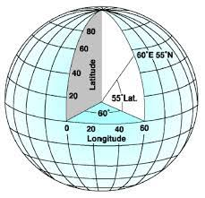

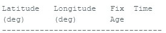

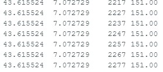

 

Je me suis ensuite renseigné sur le fonctionnement des coordonnées GPS, par exemple Biot est situé en 43.63°E 7.10°N.

Après quelque test dehors je me suis rendu compte que le gps à une résolution de 20m, ce qui est plus de la largeur de la plage à Antibes, j'ai donc décidé de ne pas utiliser le GPS pour le moment en attendant de trouver une meilleure option pour restreindre une zone de fonctionnement pour le robot.

 

Dans un second temps j'ai retravaillé mon code Arduino afin de régler les éventuelle bug et faciliter le débogage. J'ai également enlevé le servomoteur supérieur du bras laser car je n'en avais pas l'utilité (je reviendrais dessus plus tard)

 

Dans le Main:

 

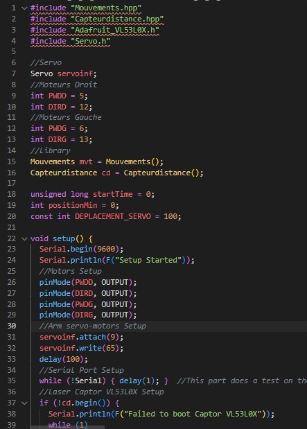

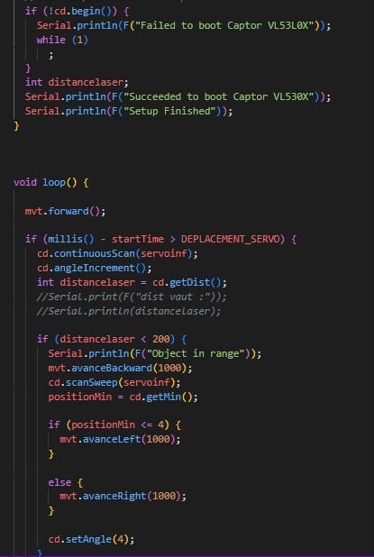

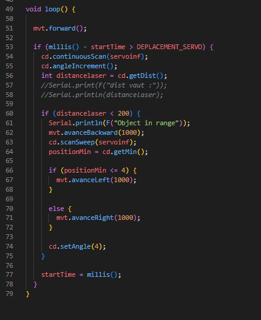

 

Dans ma library Capteurdistance:

 

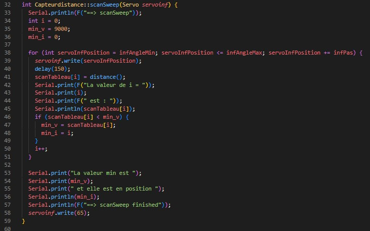

 

Dans un 3e temps, j'ai modifié mon bras car je n'avais pas l'utilité du mouvement en hauteur, j'ai donc fait un socle et une tête sur laquelle sera positionné le laser:

 

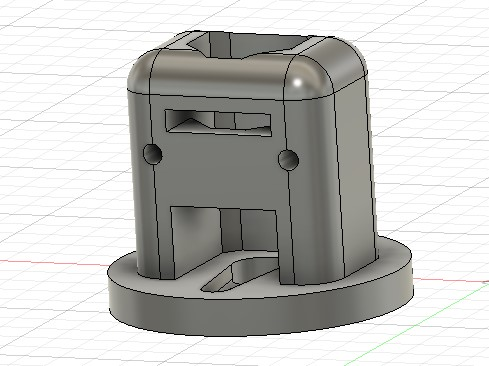

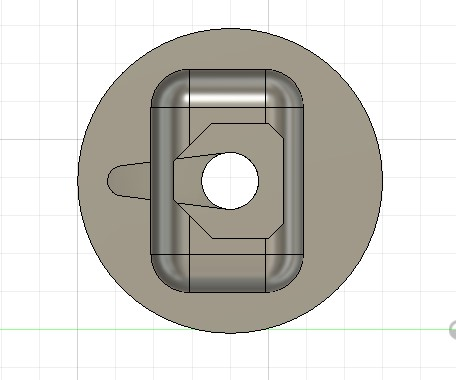

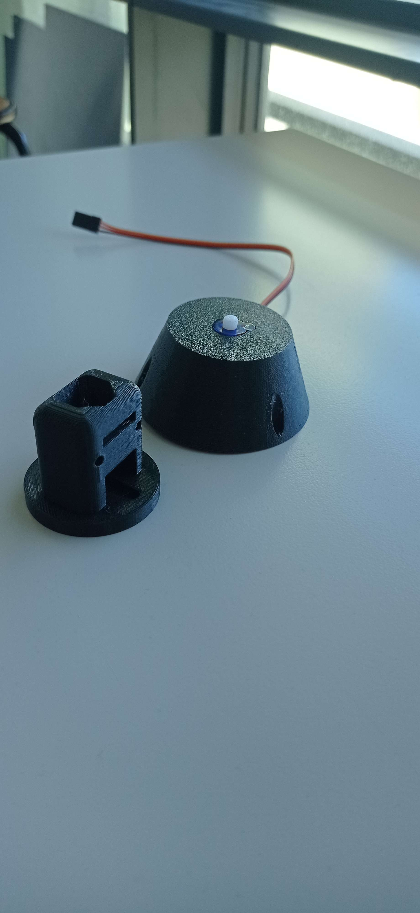

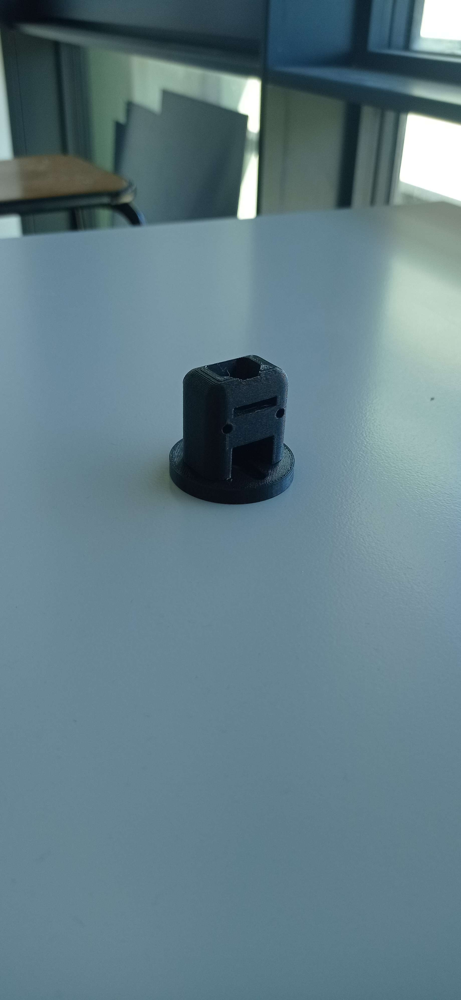

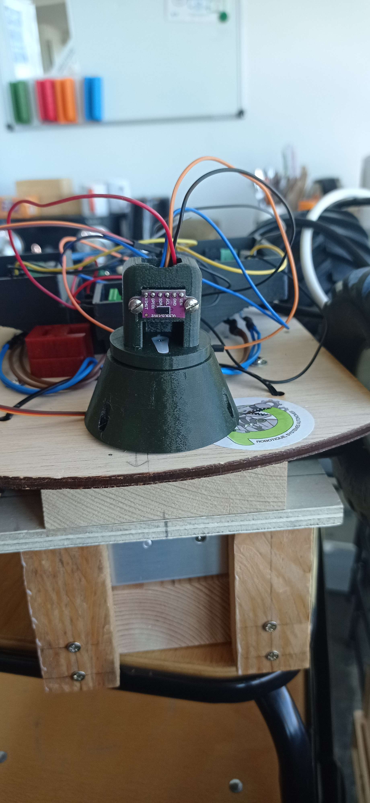

 

Ce nouveau support est plus stable et plus propre visuellement.

 

Dans un quatrième et dernier temps, j'ai essayer de mesurer la consommation du robot pour pouvoir dimensionner la batterie. J'ai donc utiliser un ampère mètre pour mesurer la valeur de chaque composants.

 

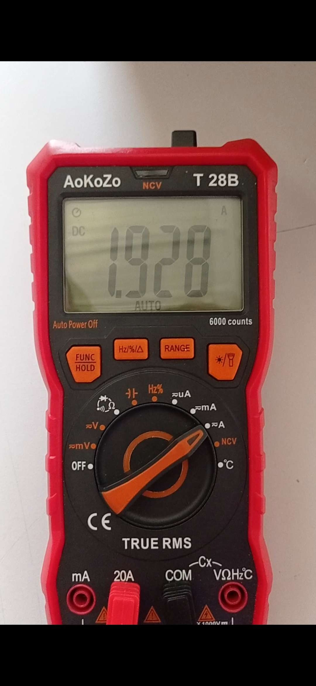

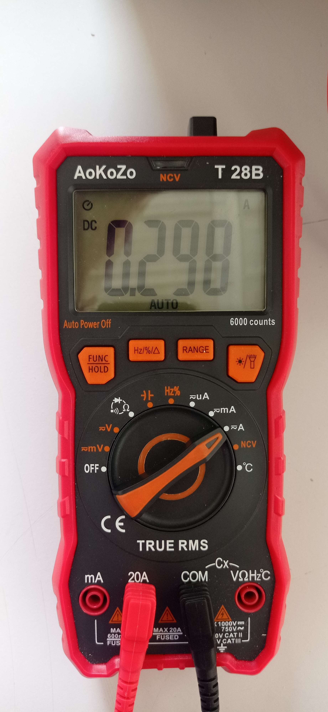

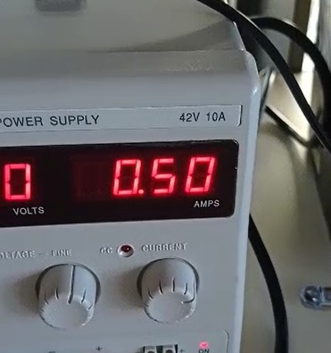

 

A vide, 2 moteurs consomment 300 mA donc 600mA lors d'un mouvement rectiligne, et lors d'un virage l'ensemble des moteurs consomment 2A. On notera ensuite que la carte arduino et le servomoteur ont une consommation moyenne de 10mA avec une valeur maximale de 50 mA. Il manque encore la consommation du moteur pas à pas de la roue-pelle ainsi que la véritable valeur de consommation des 4 moteurs de déplacement lorsqu'ils devront déplacer le poids du robot.