# Rapport de séance du mardi 25/04/2023

### Goal of the session: GPS, To do list

 

J'ai finalement reconsidéré le fait d'utiliser le GPS dans le robot, le fonctionnement resterais le même que dans le rapport du 2023-04-04. J'ai mis un interupteur pour permettre d'avoir une selection dans le mode de fonctionnement, un mode avec GPS pour l'exterieur, et un mode sans pour les démonstration en intérieur.

 

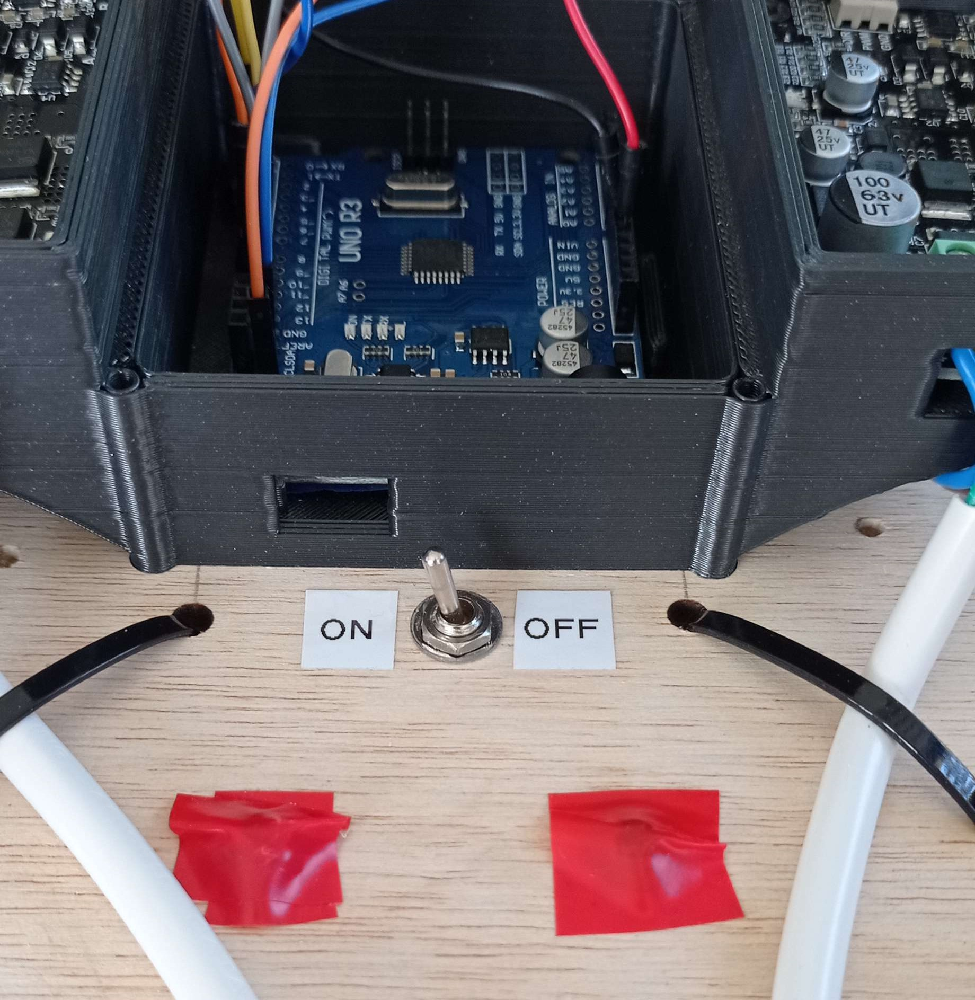

 

J'ai ensuite mis le programme du GPS en library de mon code:

 

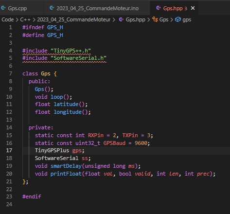

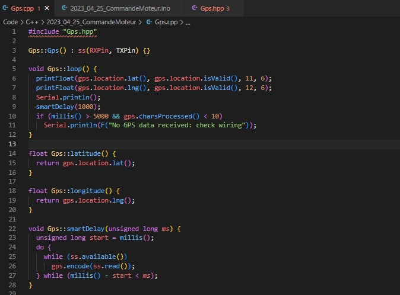

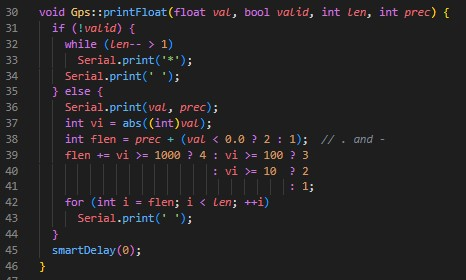

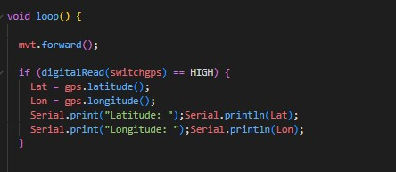

 

Ce code me permet quand je mets l'interupteur sur ON de me donner la position en latitude et longitude au fur et à mesure que le robot avance.

 

J'ai également refait l'électronique de puissance en centralisant tout sur un seul cable d'alimentation de sortie, qui permets également d'alimenter la carte arduino grace à son port 12V:

 

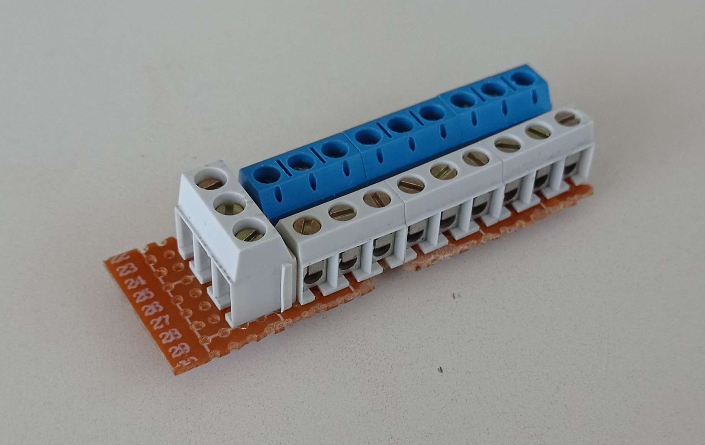

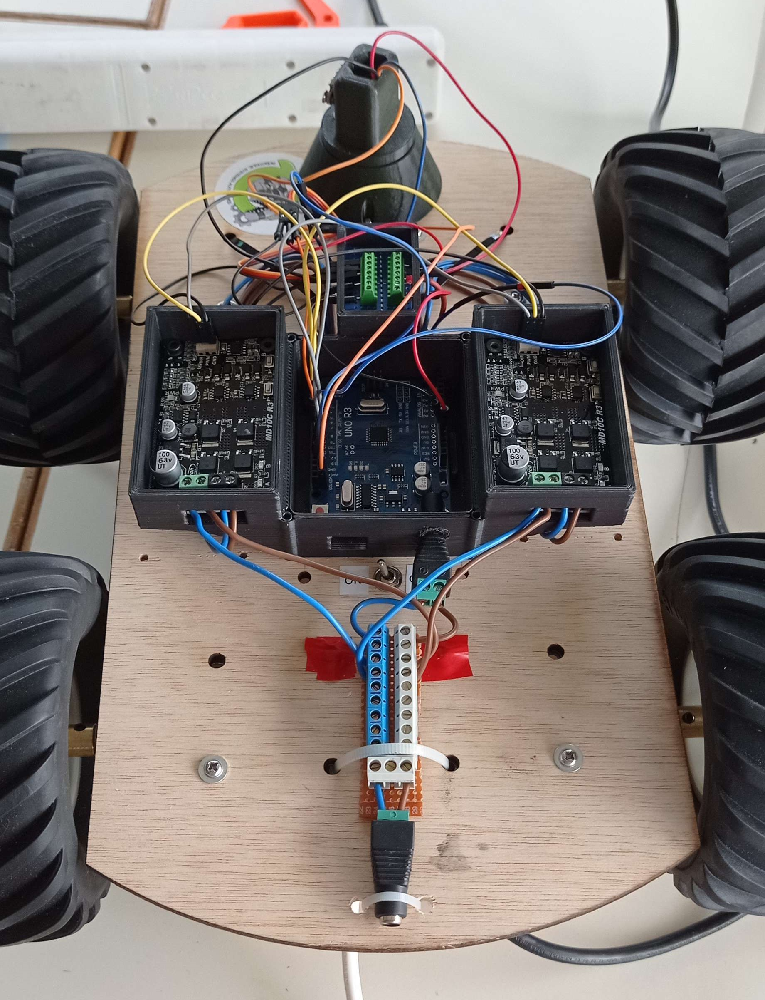

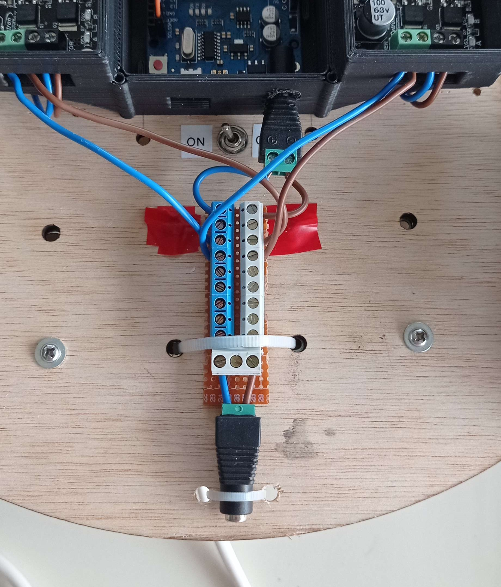

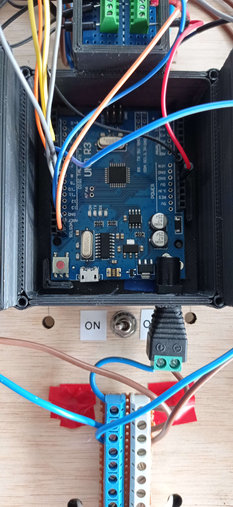

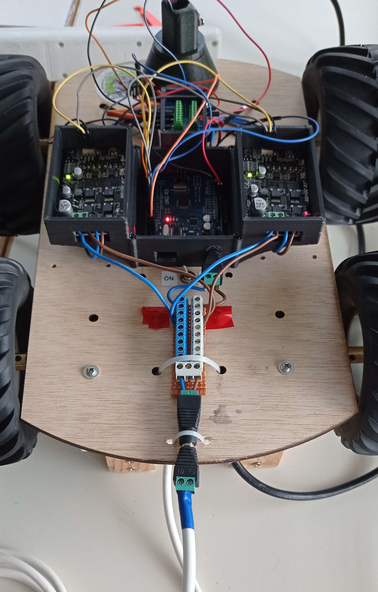

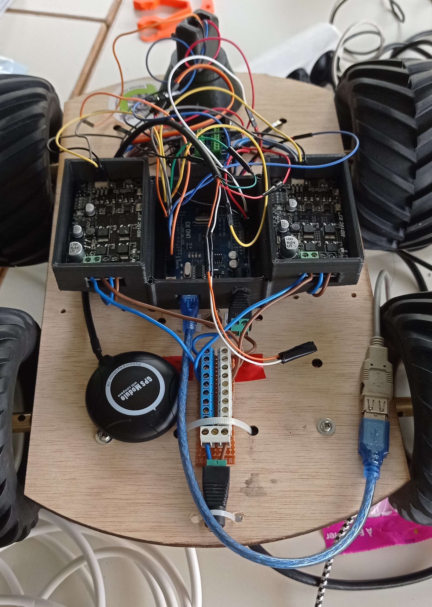